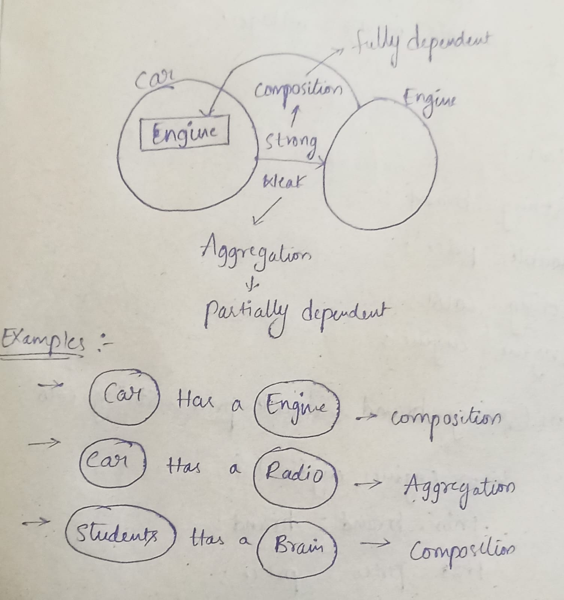

# Object Oriented Programming concepts
&rarr;&nbsp; This concepts are used to represents the real world objects into a program.<br>
&rarr;&nbsp;The real world objects can be recoginzed by its properties and behaviors.<br>
&rarr;&nbsp;This properties of a **object** are represented as    **"Global variables"** and **behaviours** are represented as **"Methods"**.<br>
&rarr;&nbsp;If the properties are changing from object to object then we ha sto declared them as **"non static global variables"**, if they are common to all the objects then we have to declared them as **"static global variables"**.<br>
&rarr; If a method is using any non static property then it is recommended to declare the method as **"Non-static "** other wise it declare it as **"Static"**.<br>

---
### Real World Objects
#### Car: 
 - Properties: <br>
 &rarr;&nbsp;**Brand**<br>
 &rarr;&nbsp;**Cost**<br>
 &rarr;&nbsp;**Color**<br>
 
 - Behavior :<br>
 &rarr;&nbsp;**Start( )**<br>
 &rarr;&nbsp;**Accelerate( )**<br>
 &rarr;&nbsp;**Brake( )**<br>
 &rarr;&nbsp;**Stop( )**<br>
 &rarr;&nbsp;**Drift( )**<br>
 
 ## Program Representation  
 ```
 class Car{
                                         // Properties
    String branch;
    double cost;
    String color;

    public void Start(){                       // Behaviour
        System.out.println("Car Start");
    }
    public void Accelerate(){                 // Behaviour
        System.out.println("Car Start");
    }
    public void Break(){                     // Behaviour
        System.out.println("Car Start");
    }
    public void Stop(){                      // Behaviour
        System.out.println("Car Start");
    }
    public void Drift(){                    // Behaviour
        System.out.println("Car Start");
    }

    public static void main(String[]args){
        // First object creation

            car c1=new car();
            c1.brand="BMW";
            c1.cost=1000000;
            c1.color="black";

        // second object creation
            car c2=new car();
            c2.brand="tata";
            c2.cost=500000;
            c2.color="blue";
    }
 }

 ```

><h2>Class : </h2>

&rarr; Class is a keyword which is used to create a non premitive datatype.<br>
&rarr; Class is a logical entity which behaves as a blue print of an object.

>## Object :

&rarr; Object is a huge memory block which is used to store the  non-static members.<br>
&rarr; Object is a real entity which is mirror image of a blue print class.<br>
&rarr; Object is a instance of class.<br>

#### Example program :-
#### Blueprint class : ####
```
 
class Mobile { //Blue print (or) business logic class
    String brand;
    double cost;
    String color;
    int RAM,ROM;

public void calling(){
    System.out.println("calling");
}
public void Chatting(){
    System.out.println("Chatting");
}
public void Playing(){
    System.out.println("Playing");
}
public void Watching(){
    System.out.println("Watching");
}
public void Clickingpics(){
    System.out.println("Selfies");
}
public void details(){
    System.out.println("Brand :"+Brand);
    System.out.println("Cost :"+Cost);
    System.out.println("color :"+Color);
    System.out.println("ROM :"+ROM);
    System.out.println("RAM :"+RAM);
    }
}

```
The above program is a blue print for the mobile and that can calling by the **Mobile store** class .
>#### user-logic class : ####
```
class MobileStore{ //user logic (or) Control-logic class
    public static void main(String[]args){
        Mobile m1=new Mobile()
        m1.branch="Nokia";
        m1.cost=24000;
        m1.color="blue";
        m1.ROM=128;
        m1.RAM=8;
        m1.details();
        System.out.println("-----------------------")

        Mobile m2=new Mobile()
        m2.branch="realme";
        m2.cost=20000;
        m2.color="black";
        m2.ROM=256;
        m2.RAM=12;
        m2.details();
    }

}
```

### Find the maximum marks in between 3 students ###
```
// Blue print class

class Students {
    int id;
    String name;    
    double marks;

    public void details() {
        System.out.println("Id: " + id);
        System.out.println("Name: " + name);
        System.out.println("Marks: " + marks);
}
	public static void main(String[]args){
	System.out.println("Hello");
	}
}

// user logic class

class School {
    public static void main(String[] args) {
        Students s1 = new Students();
        s1.id = 100;
        s1.name = "balu";
        s1.marks = 36.26;

        Students s2 = new Students();
        s2.id = 101;
        s2.name = "ramesh";
        s2.marks = 62.26;

        Students s3 = new Students();
        s3.id = 102;
        s3.name = "mahesh";
        s3.marks = 45.26;

        Students max = max(s1, s2, s3);
        max.details();
    }

    public static Students max(Students s1, Students s2, Students s3) {
        Students max;
        if (s1.marks > s2.marks && s1.marks > s3.marks)
            max = s1;
        else if (s2.marks > s3.marks)
            max = s2;
        else
            max = s3;
        return max;
    }
}
```
- ### Find the minimum marks in between 3 students ###
```
// Blue print class 
class Students {
    int id;
    String name;    
    double marks;

    public void details() {
        System.out.println("Id: " + id);
        System.out.println("Name: " + name);
        System.out.println("Marks: " + marks);
    }
}

// User-logic class

class School {
    public static void main(String[] args) {
        Students s1 = new Students();
        s1.id = 100;
        s1.name = "balu";
        s1.marks = 36.26;

        Students s2 = new Students();
        s2.id = 101;
        s2.name = "ramesh";
        s2.marks = 62.26;

        Students s3 = new Students();
        s3.id = 102;
        s3.name = "mahesh";
        s3.marks = 45.26;

        Students min = min(s1, s2, s3);
        min.details();
    }

    public static Students min(Students s1, Students s2, Students s3) {
        Students min;
        if (s1.marks < s2.marks && s1.marks < s3.marks)
            min = s1;
        else if (s2.marks > s3.marks)
            min = s2;
        else
            min = s3;
        return min;
    }
}
```
- ### Find the second maximum marks of the 3 students ###
``` 
// blue print class

class Students {
    int id;
    String name;    
    double marks;

    public void details() {
        System.out.println("Id: " + id);
        System.out.println("Name: " + name);
        System.out.println("Marks: " + marks);
    }
}

//user-logic class

class School {
    public static void main(String[] args) {
        Students s1 = new Students();
        s1.id = 100;
        s1.name = "balu";
        s1.marks = 36.26;

        Students s2 = new Students();
        s2.id = 101;
        s2.name = "ramesh";
        s2.marks = 62.26;

        Students s3 = new Students();
        s3.id = 102;
        s3.name = "mahesh";
        s3.marks = 45.26;
	Students secmax =secmax(s1,s2,s3); // second max method calling
	secmax.details(); // calling the details method in Students
	
// maxium marks method

}
   public static Students max(Students s1, Students s2, Students s3) {
        Students max=null;
        if (s1.marks > s2.marks && s1.marks > s3.marks)
            max = s1;
        else if (s2.marks > s3.marks)
            max = s2;
        else
            max = s3;
        return max;
    }

    // minimum marks method

public static Students min(Students s1, Students s2, Students s3) {
        Students min;
        if (s1.marks < s2.marks && s1.marks < s3.marks)
            min = s1;
        else if (s2.marks > s3.marks)
            min = s2;
        else
            min = s3;
        return min;
    }

// Second max method

public static Students secmax(Students s1,Students s2,Students s3){
	double secmax=(s1.marks+s2.marks+s3.marks)-(max(s1,s2,s3).marks+min(s1,s2,s3).marks);
	if(secmax==s1.marks)
		return s1;
	if(secmax==s2.marks)
		return s2;
	return s3;
	}
}
```
- ### Find all the employees whose salary is greater than average salary and print their details ###
```
class Employee{
	int id;
	String name;
	double salary;

	public void details(){
		System.out.println("id :"+id);
		System.out.println("Name :"+name);
		System.out.println("Salary :"+salary);
	}
}

class Office{
	public static void main(String[]args){
		Employee e1= new Employee();
		e1.id=100;
		e1.name="suresh";
		e1.salary=45000;

		Employee e2= new Employee();
		e2.id=101;
		e2.name="ramesh";
		e2.salary=37000;

		Employee e3= new Employee();
		e3.id=102;
		e3.name="raghu";
		e3.salary=28500;

		Employee e4= new Employee();
		e4.id=104;
		e4.name="jyothi";
		e4.salary=27000;

		Employee e5= new Employee();
		e5.id=104;
		e5.name="praveent";
		e5.salary=56000;
		
		AverageSalary(e1,e2,e3,e4,e5);
		
	}


	public static void AverageSalary(Employee e1,Employee e2,Employee e3,Employee e4,Employee e5){
		double avgsal=(e1.salary+e2.salary+e3.salary+e4.salary+e5.salary)/5;
			if(e1.salary>avgsal)
				e1.details();
			if(e2.salary>avgsal)
				e2.details();
			if(e3.salary>avgsal)
				e3.details();
			if(e4.salary>avgsal)
				e4.details();
			if(e5.salary>avgsal)
				e5.details();
	
	}	
}
```
>## Constructor ##

&rarr; The constructor is a special kind of method which is used to intilize non static properties of an object.

### Rules to create a Constructor :- ###

- The Constructer name should be same as <u>**"Class name"**</u> .
- Constructer Should not have any return type even void also.

> ### Syntax ###
```
ClassName( formal Arguments ) {
       -----------
       -----------  //Statements
       -----------
       -----------
}
```
### Example:-1 ###
 ```
 class A{
    int a;
    String s;
    A(int a,String s){ 
        this.a=a;
        this.s=s;
    }
 }
 public static void main(String[]args){

    A ob=new(100,"Hello");
 }
 ```
### Example:-2 ###
```
//Blue print class

class Movie{
    String title;
    String Director;
    double budget;
    double duration;
    
    Movie (String title,String Director,double budget,double duration){
        this.title=title;
        this.Director=Director;
        this.budget=budget;
        this.duration=duration;
    }
    public void details(){
        System.out.println("title:"+title);
        System.out.println("Director:"+Director);
        System.out.println("budget:"+budget);
        System.out.println("duration:"+duration);
        System.out.println("------------------------------");
    }

}
// user-logic class

class Main{
    public static void main(String[]args){
        Movie m1=new Movie("RRR","SS.rajmoli",200000000,2.5);
        Movie m2=new Movie("peddi","bucchi",10000000,3.0);
        Movie m3=new Movie("rc17","Sukumar",200000000,3.5);

        m1.details();
        m2.details();
        m3.details();

    }
}
```
>**Output:**
```

title:RRR
Director:SS.rajmoli
budget:2.0E8
duration:2.5
------------------------------
title:peddi
Director:bucchi
budget:1.0E7
duration:3.0
------------------------------
title:rc17
Director:Sukumar
budget:2.0E8
duration:3.5
------------------------------
```
- Constructer executes Automatcically during the object creation .
- Constructer is also a non static member.

`Note:-`<br>
- We can also intilize static properties with the help of constructer but it not recomended to use but it is not recomended to use .Because static members can be accessed with out object creation.

**Example:-**
```
class A{
    int a;
    static int b;
    A(int a,int b){
        this.a=a;
        this.b=b;
    } 
    public static void main(String[]args){
        System.out.println(b);
        A ob=new A(10,20);
        System.out.println(ob.a);
        System.out.println(b);
    }
}
```
## Types of Constructers : ##
 
We have a 2 types of constructers 
1. Predefined Constructor
2. User defined Constructor 

### 1. Predefined Constructer : ### 
&rarr; Default Constructer is only the constructer Which is a predefined constructer and it is automatically created by the compiler, Only when we dont't create any constructer.


> **Syntax :**
```
B(){ // Default Constructer

    super();

}
```
### 2. User defined Constructers : ###

The user defined constructers can be classified into 2 types :
- Paramererized constructers
- Non- paramenterized constructers

**1. Parameterized Constructers :** <br>
&rarr; A constructer which is created manually  by the developer with **Formal Arguments** is called **" parameterized constructer "**.<br>
&rarr; By using parametrized constructer we can perform dynamic intilization of objects.

**2. Non-parameterized Constructor / No Argument Constructer :**<br>
&rarr; The constructer which is created manually by the developer with **no formal arguments** is called **"Non-parameterized Constructor"**.
>**Syntax :**
```
B(){
    this.a=22;
    this.d=23.2;
}
```
- **Example:**
```
class B(){
    int a;
    double b;
    B(int a,double b){
        this.a=a;
        this.b=b;
    }
    B(){
        this.a=22;
        this.b=23.3;
    }
    public void data(){
        System.out.println(a);
        System.out.println(b);
    }
    Public static void main(String[]args){
        B ob1=new B(10,23,4);
        ob1.data();
        System.out.println("---------------------");
        B ob2 =new B(123,73.2);
        ob2.data();
        System.out.println("---------------------");
        B ob3 =new B(123,73.2);
        ob3.data();
        System.out.println("---------------------");
        B ob4 =new B(123,73.2);
        ob4.data();
        System.out.println("---------------------");
    }
}
```
**Output :**
```
10
23.4
---------------------
123
73.2
---------------------
123
73.2
---------------------
123
73.2
---------------------
```

&rarr; Constructor is mandatory for every class.<br>
&rarr; We cannot call the constructor Explicitly.

>## Constructor Overloading : ##
&rarr; The process of creating multiple construtor with different **formal arguments** is called **" Constructor Overloading "**.<br>
&rarr; The main purpose of constructor overloading is create (or) represent the same object in different forms.

**Example :**
```
class Box{
    double length;
    double breadth;
    double height;
    Box(double length,double breadth){
        this.length=length;
        this.breadth=breadth;
    }
    Box(double length,double breadth, double height){
        this.length=length;
        this.breadth=breadth;
        this.height=height;
    }
    public void display(){
	System.out.println("length: "+length);
	System.out.println("Breadth: "+breadth);
	System.out.println("Height: "+height);
	System.out.println("---------------------");
     }
	
 
}
class main{
    public static void main(String[]args){
        Box b1=new Box(10,20);
	b1.display();
        Box b2=new Box(10,20,30);
	b2.display();

    }
}
```
**Output :**
```
length: 10.0
Breadth: 20.0
Height: 0.0
---------------------
length: 10.0
Breadth: 20.0
Height: 30.0
---------------------
```
>## Constructer chaining :- ##
&rarr; The processing of calling from one constructor from another constructor by using **" this( ) "** or **" super( ) "** statements is called **constructor chaining**.<br>
&rarr;The purpose of constructor chaining is to avoid redundency of the code between the constructors.

### 1. This( ) Statement:- ### 
&rarr; This( ) statement is used to call constructor of the same class based on Actual and formal arguments.<br>
&rarr; This( ) statement should be the 1st statement in the constructor.<br>
&rarr;This( ) statement is not mandotory statement, if we need it we have to create it manually .<br>
&rarr;In a class if we have " n constructors" then we can have maximum "n-1" this( ) Statements minimum "0" this( ) call Statements.<br>
&rarr; In a class if we have only one constructor these we can't have this( ) Statements because of the some reasons.

### 2.Super( ) Statement:- ###

&rarr; The super( ) statement is used to call constructor of another class i.e parent class.<br>
&rarr; Super( ) statement is also the first statement in the constructor.<br>
&rarr; Super( ) Statement is mandatory for every class.<br>
&rarr; If we don't create any statement then super( ) statement is automatically created by the compiler.<br>
&rarr; If a class if we have "n constructor" then we can have maximum "n" super( ) statements and minimum "1" super( ) statement.<br>
>Example-1:
```
class Box{
    int length,breadth,height;
    Box(int length,int breadth){
        this.length=length;
        this.breadth=breadth;
    }
    Box(int length,int breadth,int height){
        this(length,breadth); //This calling statement
        this.height=height;
    }
    public void area(){
        if(height==0)
            System.out.println("Area:"+length*breadth);
        else
            System.out.println("Volume:"+length*breadth*height);
    }
}
```
>Example-2:- 
```
class Student{
    String name ;
    int num;
    double tenth,twelth,graduation;
    Student (String name ,int num,double tenth){
        this.name=name;
        this.num=num;
        this.tenth;
    }
    Student (String name ,int num,double tenth,double twelth){
        this(name,num,tenth);
        this.twelth;
    }
    Student (String name ,int num,double tenth,double twelth double twelth){
        this(name,num,tenth,twelth);
        this.graduation=graduation;
        
    }
}
```
>## Constructor Chaining : ##
&rarr;The processing of calling from one constructer from another constructer by using **this() or Super()** statements is called **" constructer chaining. "**<br>
&rarr;The purpose of constructor chaining is to avoid redundency of the code between the constructors.

### 1. This() Ststement :- ###
&rarr; This() statement is used to call constructes of the same class based on Actual and formal Arguments.<br>
&rarr; The **This()** Statement should be the 1st Statement in the constructor."<br>
&rarr; This statement is not a mandatory Statement, if we need it we have to create it manually.<br>
&rarr; In a Class if we have **n-constructors** then we can have **maximum "n-1" this( ) Statements and minimum " 0 " this( )call Statements.**<br>
&rarr; In a class if We have only one constructor then we can't have this( ) statements because of some reasons.

1. Super( ) statement is mandatory in class.
2. It may lead to recursion.
3. It may lead to compile time binding error.

&rarr; We can have this ( ) statement only we have overloaded constructors.

### Super( ) Statements : ###
&rarr;  Super( ) Statement is used to call Constructor of another class i.e **parent class.**<br>
&rarr; Super( ) Statement is also the first statement in the constructor.<br>
&rarr; Super() statement is mandatory for every class.<br>
&rarr; If we don't create any Statement then super( ) statement is automatically created by the compiler.<br>
&rarr; In a class if we have n-constructors then maximum " n " super( ) call statements and minimum " 1 " suuper () statement.

>**Example :**
```
Class Box{
    int length;
    int breadth:
    int height;
    Box (int length, int breadth){
        this.length=length;
        this.breadth=breadth;
    }
    Box (int length, int breadth, int height) {
        this(length, breadth);  // calling before constructer 
        this.height=height;
    }
        
        public void area( ){
            if (heigth==0)
                System.out.println("Area:"+length*breadth);
            else
                 System.out.println("Volume :"+length*breadth*height);

```
>**Example :**
```
Class Student{
    Sting name;
    int num;
    double tenth, twelth, grad;
    Student (string name int num, double tenth){
        this. name = name;
        this. num= num;
        this. tenth= tenth;
    }
    Student (sting name, int num, double tenth, double twelth) {
        this (name, num, tenth);
        this.twelth=twelth;
    }
    Student (string name, int num, double tenth doub twelth, double grad){
        this (name, num, tenth, twelth);
        this.grad = grad;
    }
}

```
>## Copy Constructor : ##
&rarr; copy constructor is used to create a new object with the data of already existed object.<br>
&rarr; copy constructor is also a parameterized constructor.
&rarr; copy constructor takes reference of the old object So we have to create a formal Arguments of Same class type.<br>
>**Example :**
```
class A {
    int a = 10;
    A (int a) {
        this.a=a;
    }
    A (A obj) {
        this.a = obj.a;
    }
}

Class main{
    Public static void main(String[] args) {
        A ob = new A(10);
        ob. a=200;
        A ob1=ob;
        ob1.a=500;
        A ob2 = new A(ob);
        ob2. a=525;
        A ob3 = new A(ob);
        ob. a=25;
    }
}

```
>## Encapsulation : ##

&rarr; The process of **binding (or) Wrapping** the properties and behaviors into a single unit is called **" encapsulation "**.<br>

### Advantages of encapsulation : ###
1. code reusability
2. Security

>### 1. Code Reusability : ###
&rarr; We are creating one encapsulated class we can create any number of objects for the Same class, and also we can use the same object many no.of times.

>### 2. Security : ###
&rarr; We are providing security by making the properties as private and we are providing control or limited access to the users by using, public **" getter "** and **" setter "** methods. <br>
&rarr; And placing the conditions within those for Validation or Authentication.<br>

### getter method (Read / Access) : ###
&rarr; It is a helper method which is used to read or Access from private property.<br>
&rarr; It is recommended to create the getter method name by prefixing the with the word **"get"**.
&rarr; for getter method **We must and should have a return type** other than void.
### Setter method (Intilize): ###
&rarr; Setter method is a **helper method** which is used to **intilize or reintilized** private properties.<br>
&rarr; It is recommended to create a setter method by prefixing its name with the word **" set "**.<br>
&rarr; for Setter method We should have the return type **" Void"** but we have to create a fomal Argument to take input to the method for intilizing of private property.<br>
>**Example :**
```
Class A{
    private int a = 10,
    private double b=20.3;
    public int getA( ){ // read or access
        return a;  
    }
    public void SetA (int a){ //intilize
        this.a=a;
    }
    public double getB( ){ 
        return b;
    }
    public double SetB( ){
        this.b=b;
    }
}
```

>**Example:-1**
```
// clock example in encapsulation
class Clock {
    private int hrs;
    private int min;
    private int sec;

    // Default constructor
    Clock() {
        hrs = 12;
        min = 0;
        sec = 0;
    }

    // Parameterized constructor
    Clock(int hrs, int min, int sec) {
        setHrs(hrs);
        setMin(min);
        setSec(sec);
    }

    // Getter & Setter for seconds
    public int getSec() {
        return sec;
    }

    public void setSec(int sec) {
        if (sec >= 0 && sec <= 59)
            this.sec = sec;
        else
            System.out.println("Invalid seconds");
    }

    // Getter & Setter for minutes
    public int getMin() {
        return min;
    }

    public void setMin(int min) {
        if (min >= 0 && min <= 59)
            this.min = min;
        else
            System.out.println("Invalid minutes");
    }

    // Getter & Setter for hours
    public int getHrs() {
        return hrs;
    }

    public void setHrs(int hrs) {
        if (hrs >= 1 && hrs <= 12)
            this.hrs = hrs;
        else
            System.out.println("Invalid hours");
    }

    // Display method
    public void showTime() {
        System.out.println(hrs + ":" + min + ":" + sec);
    }
}

// Main class
class ClockTower {
    public static void main(String[] args) {
        Clock c1 = new Clock();
        c1.setSec(20);
        c1.setMin(30);
        c1.setHrs(8);

        System.out.println(c1.getHrs() + ":" + c1.getMin() + ":" + c1.getSec());

        Clock c2 = new Clock(4, 25, 19);
        c2.showTime();
    }
}
```
> **Example :-2**
```
// Example on Employees by using Encapsulation

    class Employee{   //Blue print class
        String name:
        int id:
        private double sal;
        Static double basesal=15000;
        public double getsal(){
            return sal;
        }
        public void Setsal(double sal){
            if (sal>basesal && sal<=500000)
                this.sal=sal
            else
                System.out.println("invalid Salary");
        }
        Public void details(){
            System.out.println("Name: "+name);
            System.out.println("id: "+id);
            System.out.println("Salary: "+sal);
            System.out.println("Base Salary: "+basesal);
        }
    }

    class Office{
        public static void main(String[]args){
            Employee e1 = new Employee();
            el.name= "Ramesh";
            e1.id= 101;
            el.getsal (15000.00);

            Employee e2 = new Employer ():
            e2.name = "Suresh"
            e2.id = 102;
            e2.getsal (20000.0);

            Employer e3 = new Employee ();
            e3.name = "Teja";
            e3.id = 103;
            e3.get sal (40,000);

            Employee e4 = new Employee();
            e4.name="Raju";
            e4.id=104;
            e4.getsal(55000.00);
        }
    }
```
>## Data Transfer Objects: ##

&nbsp;&nbsp;&nbsp;Encapsulated classes are also called **Data Transfer objects (DTO) or "Java beans" or "POJO".**

## Relation :- ##

Relation specifies bond between the objects and 
<br>we have 2 types of relations.

1. Has-A relation

2. Is-A relation (Inheritance)

>### Has-A relation : ###

&rarr; It is a whole-part relation where one Object present inside another object as its own property.
<br>

we have 2 types of Has-A relation
- Composition
- Aggregation

### Composition: ###

&rarr; Composition specifies Strong bond between the Objets, Where we cannot have one object with out another object.

### Aggregation : ###
&rarr; Aggregation specifies weak bond between the objects where we can have one object with or without another object.<br>
&rarr; Aggregation also says, that The objects are partially dependent on each other.



>**Example :**
```
//Engine blue print class 

Class Engine{
    int cc;
    double hp;
    int milage;
    Engine (int cc, double hp, int milage){
        this.cc=cc;
        this.hp=hp:
        this.milage=milage
    }
}

// car blue print class

Class car{
    String brand:
    double price;
    String color;
    Engine engine;
    Car (String brand, double price, String color,Engine engine){
        this.brand=brand;
        this.price=price;
        this.color=color;
        this.engine=engine;
    }
}

//User logic class
class Carshowroom{
    public static void main (string[]args){
        Car c1 = new Car("AUDI",5000000,"black",new Engine(1000, 1800,12));
        System.out.println(c1.branch);
        System.out.println(c1.price);
        System.out.println(c1.color);
        System.out.println(c1.engine.cc);
        System.out.println(c1.engine.hp);
        System.out.println(c1.engine.milage);
    }
}
```
>**Example:- Pen Has-A cap**
```
class pen{
	String color;
	Cap cap;
	pen(String color,Cap cap){
		this.color=color;
		this.cap=cap;
	}
	public void write(){
		System.out.println("Writing");
	}
}
class Cap{
	public void Opencap(){
		System.out.println("Opening cap");
	}
	public void Closecap(){
		System.out.println("Closing cap");
	}
}
class Writingnotes{
	public static void main(String[]args){
		pen p1 =new pen("blue",new Cap());
		p1.cap.Opencap();
		p1.write();
		p1.cap.Closecap();
	}
}
```
>**Example:- ATM Has-A Cashdispensor**
```
class CashDispensor {
    static int cashavailable = 10000;  
}

class ATM {
    public void Withdraw(int amount) {
        if (amount > 0 && CashDispensor.cashavailable >= amount) {
            CashDispensor.cashavailable -= amount; // reduce cash
            System.out.println("Withdraw Successful. Remaining Balance: " + CashDispensor.cashavailable);
        } else {
            System.out.println("Insufficient balance");
        }
    }

    public void Deposit(int amount) {
        if (amount > 0) {
            CashDispensor.cashavailable += amount; // increase cash
            System.out.println("Deposit Successful. Current Balance: " + CashDispensor.cashavailable);
        } else {
            System.out.println("Invalid deposit amount");
        }
    }

    public void CheckBalance() {
        System.out.println("Your balance is: " + CashDispensor.cashavailable);
    }
}

class SBIATM {
    public static void main(String[] args) {
        ATM a1 = new ATM();

        a1.Withdraw(1000);
        a1.Deposit(5000);
        a1.Withdraw(12000);
    }
}
```


